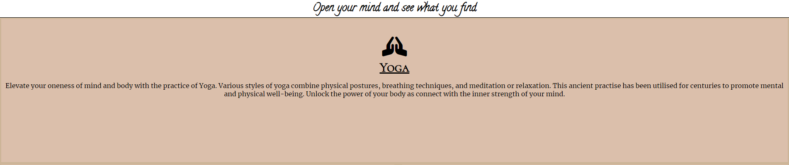
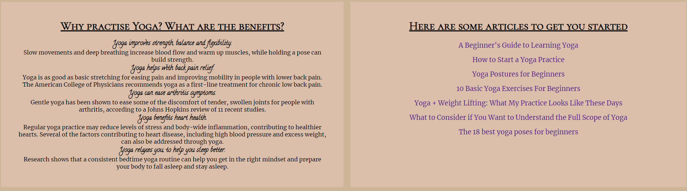
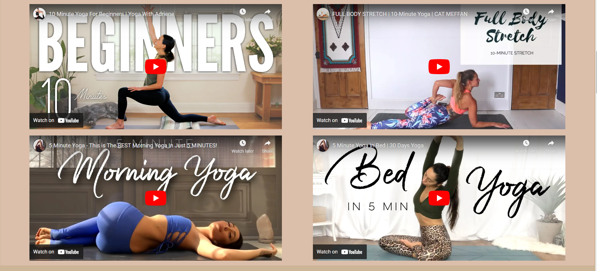

# Medi-Mind

Medi-mind is a website intended to serve as a resource for those interested in learning about Yoga, meditation and mindfulness. It is aimed at beginners of these practises and hosts basic information, video and links to further information. 

The site hopes to be a good entry point for those with little to no knowledge of these practises and aims to be a resource to leap frog to further learning from.

View the live website [here](https://davidjf97.github.io/medimind/) 

## Features

### Header and Footer

* Navigation Bar
    * Located at the top of the page is a navigation bar. Each links to the corresponding section of the site's stand alone page.
    * This is useful to users as upon landing on the page they can see the content that is available and instantly navigate to their desired section of the site

* Social Media Links
    * Locate at the bottom of the page are the social media links, opening in new tabs.
    * This feature encourages further interactions as users can follow the site's social media pages and receive updates on their socisal media platform of choice

### Page Content

* Hero Image
    * The Hero image features a picture of cross-legged mediation along with text stating the website's title and slogan.
    * This serves to greet the user with a calming image and gentle reminder of the website's function as a resource host.

* Section intro block
    * Each section of content in the website is broken in to several blocks, starting with an intro block featuring an icon and a few lines of text
    * This serves as an intro to the section, aiming to quickly give the user a rough idea of what to expect frm the following section.   

* Benefits and Articles
    * Following the intro block, the website presents the benefits and article blocks. the benefits section give the user a quici rundown of some noteable benefits of the practise while ther articles sections provides click-through links to external articles stating further benefits and hints and tips to develop their knowledge of the practise.
    * Both of thes help users familiarise themselves with the benefits of the practise and get them started on acquiring the necessary knowledge to further their understanding of the why and how of each practise.

* Videos section
    * The video section features serveal useful yoube videos on the respective practise.
    * This section works as a visual aid in the user's learning as they can wacth and learn and even follow along with the videos featured.

* Sign-Up
    * The sign up section allows user to leave thier information in order to sign up to the mailing list to recieve further information to their email.
    * This is a great way to get users to engage with the website and continue to grow their understanding of the practises even when off-site.

### Features left to implement
* 

## Testing

### Responsiveness

The site was tested to ensure responsiveness on screen sizes from 320px and upwards on Google Chrome, Microsoft Edge and Internet Explorer.

Steps to test:

1 Open browser and navigate to Medi-Mind

2 Open the developer tools (right click and inspect)

3 Set to responsive and decrease width to 320px

4 Set the zoom to 50%

5 Click and drag the responsive window to maximum width

Expected:

Website is responsive on all screen sizes and no images are pixelated or stretched. No horizontal scroll is present. No elements overlap.

Actual:

Website behaved as expected.

Website was also opened on the following devices and no responsive issues were seen:
Iphone SE, Iphone XR, Ipad Air, Ipad Mini

## Credit
* Icons used all from free icons list at [Font Awesome](https://fontawesome.com/)
* Footer Social media links code adopted from Love Running website.
* Images used sourced from [Pexels](https://www.pexels.com/)
* All articles used are credited to their appropriate author as stated on the websites linked